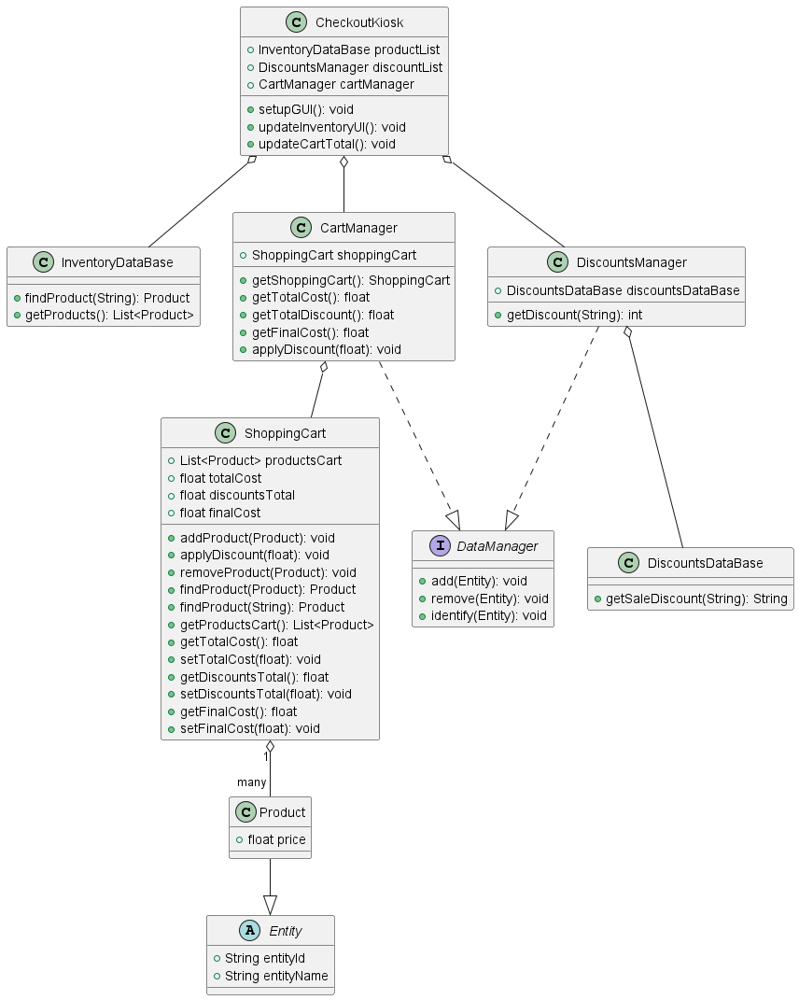
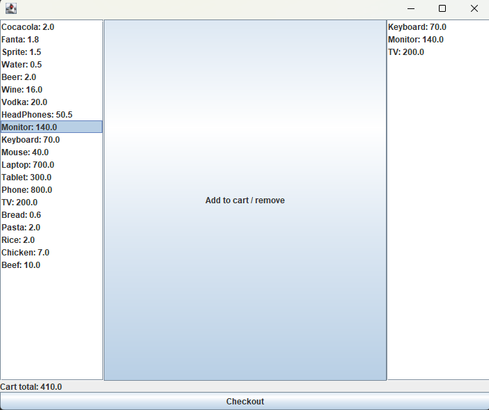
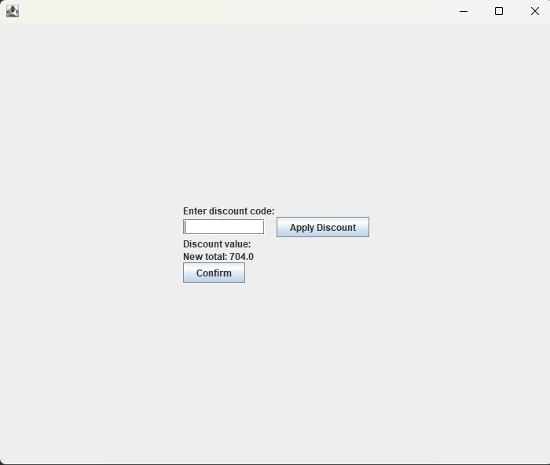
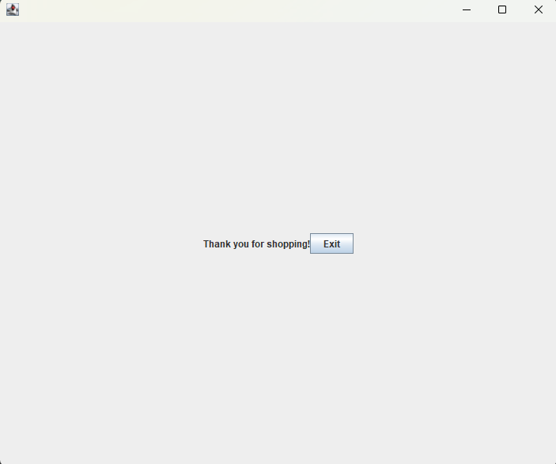

# CleanCash project
## Description
This project is a simple cash register that allows you to add products to the cart, remove the products you do not want and calculate the total price of the purchase.
Also, you can add some discount codes to the products and see the total price with the discount applied.

## Description of the functionalities
- Add products to the cart: This functionality allows you to add products to the cart. You can add as many products as you want.
- Remove products from the cart: This functionality allows you to remove products from the cart.
- Add discount codes to the products: This functionality allows you to add discount codes to the products. Depending on the discount code you add, the price of the product will be different.
- Calculate the total price of the purchase: This functionality allows you to calculate the total price of the purchase. This price is calculated previously without applying any discount and if you add discount recalculates the price.
- See the list of products of the store: This functionality allows you to see the list of products that are in the store.
- See the list of products of the cart: This functionality allows you to see the list of products that are in the cart.

## UML Diagram

## Images of the project
### Start menu

### Products menu

### Price menu

### Price with discount menu

### Exit

## Usage Guide
To run this project first you need to download the project and a Java environment. Then you need to open the project in your Java environment and run the main class.
Once you run the main class you will see the menu of the project and you can start using it.

## Authors
- Diego García Niño
- Jose Manuel Rasilla Paz
- Javier Salmerón Jurado
