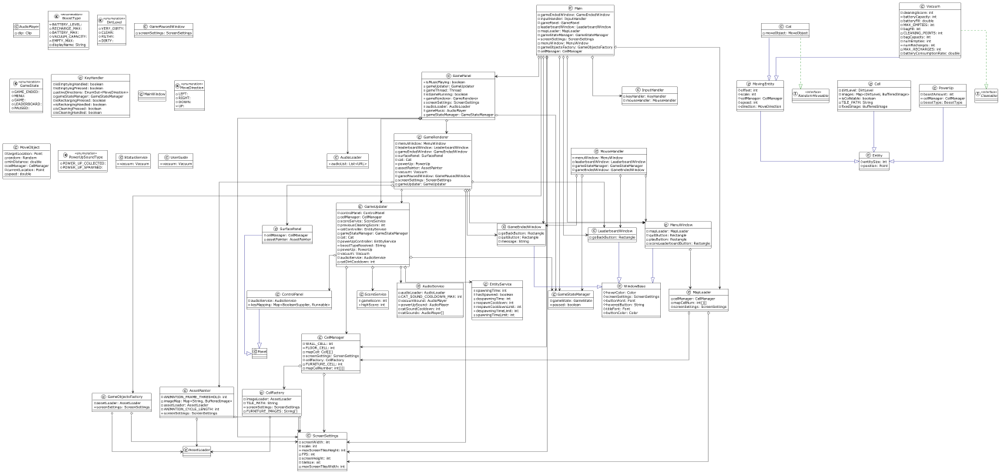
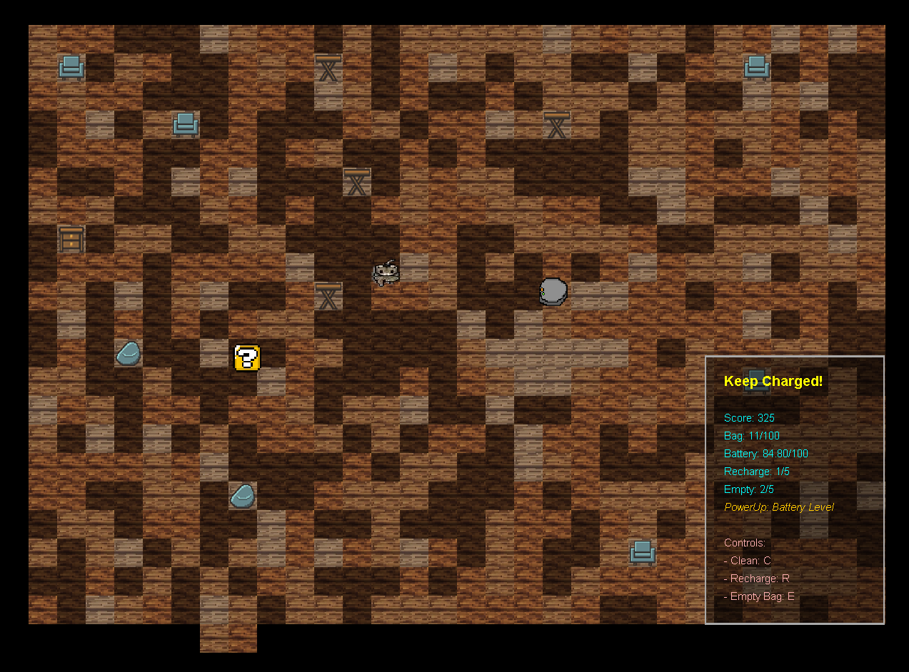
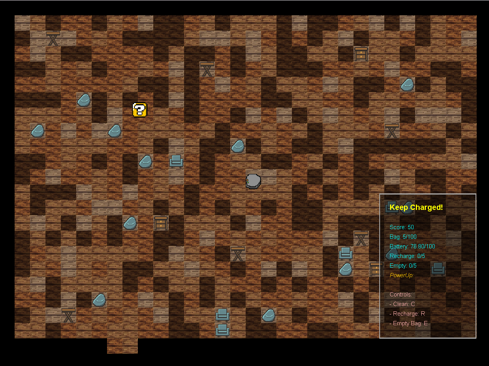

# Tricodex Vacuum Cleaner

## Descripción

Tricodex Vacuum Cleaner es un juego de simulación desarrollado en Java donde el jugador toma el control de una aspiradora inteligente cuyo objetivo es limpiar un entorno de diferentes niveles de suciedad, mientras evita obstáculos y recoge potenciadores. Fue diseñado para proporcionar una experiencia interactiva a los usuarios, al tiempo que incorpora conceptos de inteligencia artificial y lógica de juego para resolver el desafío de navegar por el entorno y limpiar eficientemente.

## Funcionalidades

1. **Navegación y Limpieza**: El jugador puede mover la aspiradora por el mapa para recolectar suciedad y limpiar el área.
2. **Potenciadores**: Los potenciadores aparecen aleatoriamente en el mapa, proporcionando diferentes ventajas, como aumentar la capacidad de la batería, incrementar la velocidad, etc.
3. **Gestión de Recursos**: El jugador tiene que administrar la batería y la capacidad de la bolsa de la aspiradora.
4. **Mapa de Juego Dinámico**: Los mapas se generan de forma dinámica para cada partida, lo que añade un elemento de aleatoriedad al juego.
5. **Puntuación**: El juego cuenta con un sistema de puntuación basado en la cantidad de suciedad recogida y el tiempo utilizado.

## Diagrama de Clases

A continuación, se presenta el diagrama de clases del proyecto. Este diagrama representa las principales clases utilizadas en el proyecto y cómo están relacionadas entre sí.

## Capturas de Pantalla

Se incluirán capturas de pantalla que demuestren las funcionalidades implementadas.

## Instrucciones de Uso

Para ejecutar el programa, siga los siguientes pasos:

1. Clone el repositorio en su máquina local.
2. Navegue hasta la carpeta raíz del proyecto a través de la línea de comandos.
3. Compile el proyecto utilizando el comando `javac`.
4. Ejecute el programa utilizando el comando `java`.
5. El juego comenzará y podrás mover la aspiradora con las teclas de flechas.

## Autores

- Javier Enrique Cáder Suay
- Andrés Elías Alarcón 
- Lucía Zamanillo Lazuén

