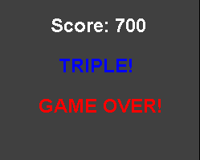

# Tetris Game

## Description
The Tetris Game is a final project for the Programming II course. 
It is implemented in Java using the SWING library.💡 The goal of the 
project is to create a classic Tetris game where players can arrange 
falling blocks to form complete lines. 🎮

## Functionalities
- Horizontal and vertical block movement: Players can move the falling blocks horizontally and vertically using arrow keys or WASD. ⬅️➡️⬇️
- Clearing of horizontal rows: When a row is completely filled with blocks, it is cleared, and players earn points. This feature replicates the behavior of the original Tetris game. ✨

 

- Random generation of figures and positions: The figures and their initial positions are generated randomly, adding an element of unpredictability to the game. 🎲

- Block rotation: Players can rotate the falling blocks to fit into the available space.🔄

   

    ❗Note that there may be issues with figures when rotating them near walls.❗
- Score display: The game includes a score display that shows the current score of the player. 🏆 The higher the score, the faster figures go down!
- Game over message: When the stack of blocks reaches the top of the game area, the game ends, and a "Game Over" message is displayed. 😔

## Class Diagram

## Instructions
To run the Tetris Game, follow these steps:
1. Copy the repository to your local machine.
2. Execute the Main class.
3. Enjoy the game! 🎉

## Authors
- Pablo Arce de Aldecoa - Reviewer -@pablarce
- Rubén Setien - Developer - @rubensetien
- Dúo Sacapuntos

### Notes about the code
- It would be better to make the classes that implement JPanel/JFrame extend from those Classes, but we chose not to because it made the game fail often.
- We chose to remain the Timers in the Game class, rather than referencing them, because it was easier to implement the game logic.

To view the upstream of the project, you can refer to this other repository: https://github.com/pablarce/Tetris.git