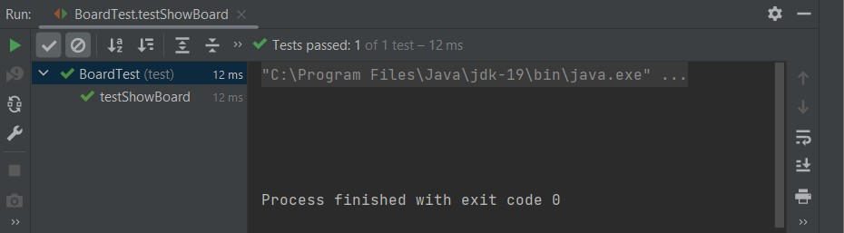
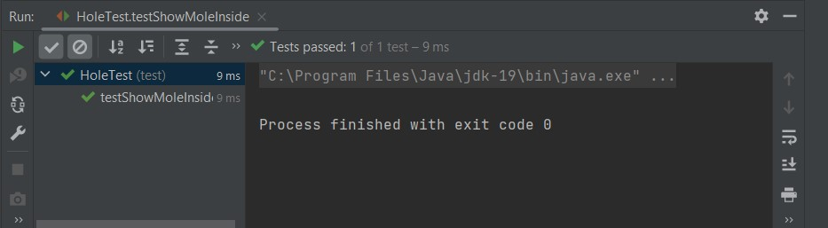
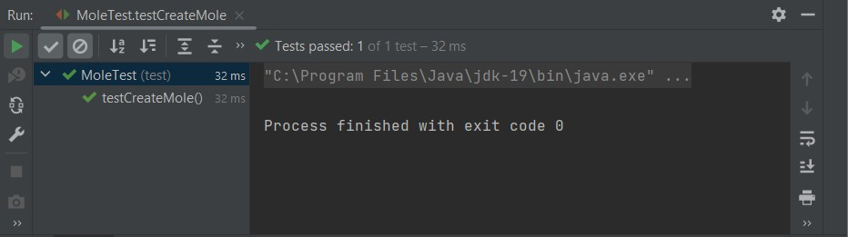
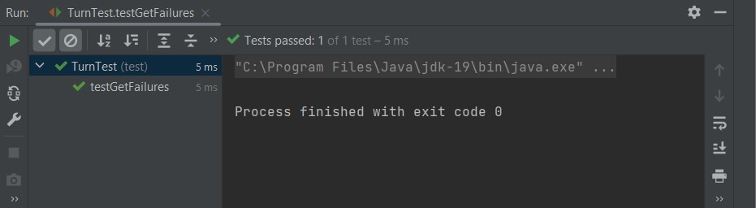
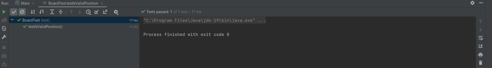
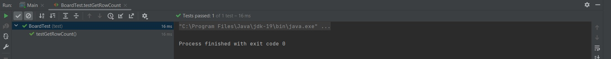

Descripción
--------------------
El proyecto es una réplica del famoso juego "Whac-A-Mole", que consiste en golpear topos en un tablero. Con este proyecto se busca resolver la problemática de diseñar un juego usando programación orientada a objetos.

--------------------
Funcionalidades
--------------------
- **Mostrar el tablero:**
Se muestra el tablero de juego.
- **Mostrar el agujero golpeado:**
Se muestra si el agujero golpeado contenía o no un topo adentro.
- **Mostrar un menu:**
Se muestra el menu principal del juego.
- **Empezar el juego:**
El juego se ejecuta.
- **Mostrar si hay un topo dentro del agujero:**
Se verifica si hay o no un topo dentro del agujero antes de ser golpeado.
- **Crear y cambiar el nombre a un topo:**
Se congifura el topo.
- **Contar los fallos:**
Se cuentan cuantas veces se falla el golpe y se golpea un agujero vacío
- **Contar los aciertos:**
Contar a cuantos topos se han golpeado.
- **Contar las columnas:**
Se cuentan las columnas del tablero.
- **Contar filas:**
Se cuentan las filas del tablero.
- **Verificar posición inválida:**
Se verifica que la posición que se tiene sea válida.

--------------------
Diagrama de clases
--------------------

--------------------
Capturas de pantalla
--------------------

--------------------
Instrucciones de uso
--------------------
- **En InteliJ IDEA:** Ejecutar el main del proyecto
- **Desde consola:** Desde consola, irse  ala ruta en la que está alojada el proyecto y ejecutar los comandos "javac [nombre del archivo]" y luego "java [nombre del archivo]"
--------------------
Autores
--------------------

- Diego Moys
- Josué Merino
- Andriuw Yépez

🔥 _Programadores Full-Stack Jr._ 🔥

**Nuestras herramientas:**
- GitHub
- BitBucket
- Visual Studio Code
- InteliJ Idea
- PHPMyadmin

**Nuestros lenguajes:**
- PHP
- Java
- JavaScript
- CSS
- C#

--------------------
Aclaraciones
--------------------
- Por equivocación, el integrante Diego Moys utilizó una cuenta de GitHub errónea (recinosjer) al subir los cambios al repositorio.
- El integrantes Andriuw Yépez no pudo subir los cambios al repositorio por su cuenta, si no que creó archivos de texto y luego Josué Merino (el encargado del repositorio) los subió como clases de Java, ya que, por un motivo que desconocemos no dejaba crear clases ni hacer cambios en el proyecto.
