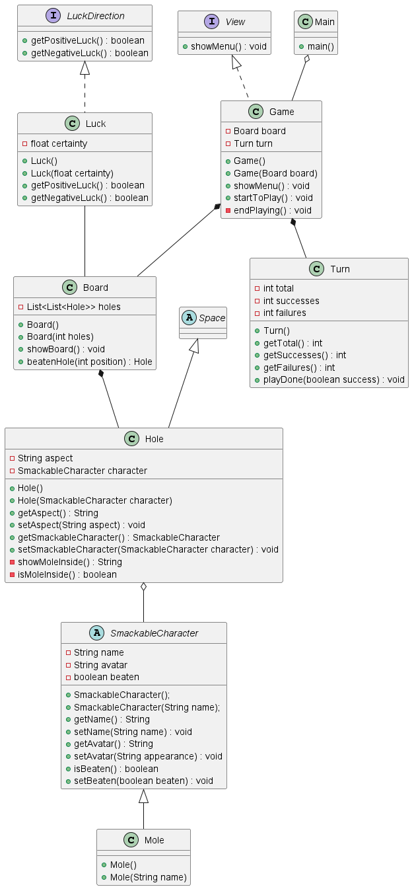

Descripción
--------------------
El proyecto es una réplica del famoso juego "Whac-A-Mole", que consiste en golpear topos en un tablero. Con este proyecto se busca resolver la problemática de diseñar un juego usando programación orientada a objetos.

--------------------
Funcionalidades
--------------------

--------------------
Diagrama de clases
--------------------

--------------------
Capturas de pantalla
--------------------

--------------------
Instrucciones de uso
--------------------

--------------------
Autores
--------------------

- Diego Moys
- Josué Merino
- Andriuw Yépez

🔥 _Programadores Full-Stack Jr._ 🔥

**Nuestras herramientas:**
- GitHub
- BitBucket
- Visual Studio Code
- InteliJ Idea
- PHPMyadmin

**Nuestros lenguajes:**
- PHP
- Java
- JavaScript
- CSS
- C#

--------------------
Aclaraciones
--------------------
- Por equivocación, el integrante Diego Moys utilizó una cuenta de GitHub errónea (recinosjer) al subir los cambios al repositorio.
- El integrantes Andriuw Yépez no pudo subir los cambios al repositorio por su cuenta, si no que creó archivos de texto y luego Josué Merino (el encargado del repositorio) los subió como clases de Java, ya que, por un motivo que desconocemos no dejaba crear clases ni hacer cambios en el proyecto.
