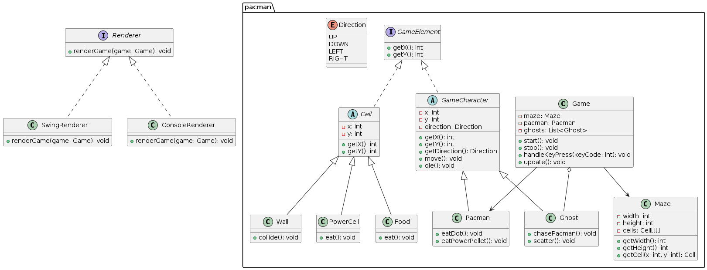

<h1 align="center">Hi 👋, We are Eduardo Estrada, Sergio Mayén, Edgar Solier</h1>
<h3 align="center">CodePro Present</h3>

<h2>Funcionalidades</h2>

- Mapeado y presentación del mundo.
- Implementación de pacman y movimento.
- Implementación de fantasmas y movimiento.
- Detallamiento del camino y muro en el mundo.
- Puntaje.
- Inicio y final del juego.

<h2>Diagrama de Clases</h2>

A continuación se presenta el diagrama creado para la jerarquización de las clases creadas y utilizadas para la funcionalidad del proyecto.

 

<h2>Capturas de pantalla</h2>

 

<h2>¿Cómo se usa?</h2>

Para el movimiento del pacman se utlizan las teclas **A,W,S,D**

<h2>Autores</h2>
<ul>
    <li>⚡ Eduardo David Estrada Rivera 💻 Dev</li>
    <li>⚡ Sergio Alejandro Mayén Ruano 💻 Tester/Documentation</li>
    <li>⚡ Edgar de Leon Du Solier 💻 Dev</li>
</ul>