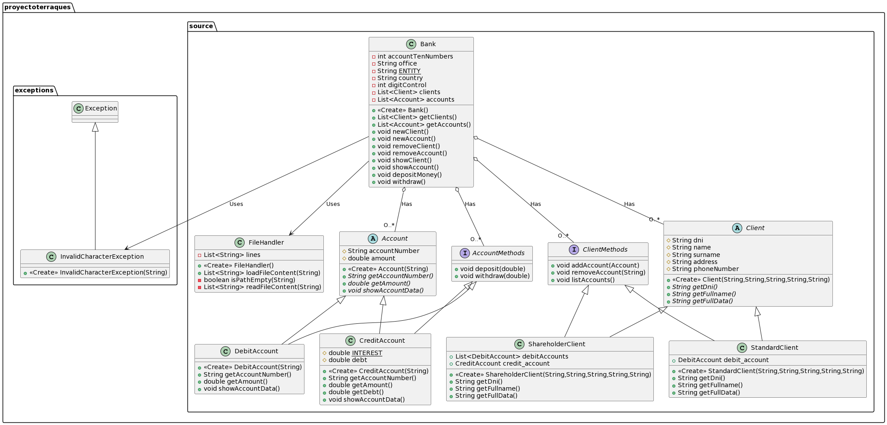

    ██████   █████  ███    ██  ██████  ██████      ███████  █████  ███    ██ ████████  █████  ███    ██ ██████  ███████ ██████  
    ██   ██ ██   ██ ████   ██ ██      ██    ██     ██      ██   ██ ████   ██    ██    ██   ██ ████   ██ ██   ██ ██      ██   ██
    ██████  ███████ ██ ██  ██ ██      ██    ██     ███████ ███████ ██ ██  ██    ██    ███████ ██ ██  ██ ██   ██ █████   ██████  
    ██   ██ ██   ██ ██  ██ ██ ██      ██    ██          ██ ██   ██ ██  ██ ██    ██    ██   ██ ██  ██ ██ ██   ██ ██      ██   ██
    ██████  ██   ██ ██   ████  ██████  ██████      ███████ ██   ██ ██   ████    ██    ██   ██ ██   ████ ██████  ███████ ██   ██ 

    ╔╦╗╔═╗╔═╗╔═╗╦═╗╦╔═╗╔═╗╦╔═╗╔╗╔
     ║║║╣ ╚═╗║  ╠╦╝║╠═╝║  ║║ ║║║║
    ═╩╝╚═╝╚═╝╚═╝╩╚═╩╩  ╚═╝╩╚═╝╝╚╝

Se trata de una aplicación de gestión bancaria, en este caso para el Banco Santander, donde en este caso el banco
Santander necesita un sistema en el que se puedan crear diferentes tipos de clientes y cuentas asi como una forma
para que un trabajador de dicho banco dependiente en la sucursal en la que trabaje pueda acceder a dicho sistema de
gestión

    ╔═╗╦ ╦╔╗╔╔═╗╦╔═╗╔╗╔╔═╗╦  ╦╔╦╗╔═╗╔╦╗╔═╗╔═╗
    ╠╣ ║ ║║║║║  ║║ ║║║║╠═╣║  ║ ║║╠═╣ ║║║╣ ╚═╗
    ╚  ╚═╝╝╚╝╚═╝╩╚═╝╝╚╝╩ ╩╩═╝╩═╩╝╩ ╩═╩╝╚═╝╚═╝

        
* [ ] Un empleado del banco puede seleccionar a que oficina desea conectarse 
* [ ] Cuando se conecta un empleado a una oficina le requiere iniciar sesión con sus credenciales
* [ ] Un empleado solo tendrá acceso a la oficina en la que trabaja 
* [ ] Los datos de las oficinas y de los empleados son obtenidas de ficheros para mantener la persistencia 
* [ ] Creación de clientes standard
* [ ] Creación de clientes accionistas
* [ ] Creación de cuentas de crédito
* [ ] Creación de cuentas de débito
* [ ] Eliminación de cuentas de crédito
* [ ] Eliminación de cuentas de débito
* [ ] Eliminación de clientes
* [ ] Mostrar los clientes existentes (y todos sus datos)
* [ ] Mostrar las cuentas existentes (y los datos de dichas cuentas)
* [ ] Depositar dinero en cuentas
* [ ] Sacar dinero de cuentas
* [ ] ... 

    ╦ ╦╔╦╗╦  
    ║ ║║║║║
    ╚═╝╩ ╩╩═╝

    ╔═╗╔═╗╔╦╗╦═╗╦ ╦╔═╗╔╦╗╦ ╦╦═╗╔═╗
    ║╣ ╚═╗ ║ ╠╦╝║ ║║   ║ ║ ║╠╦╝╠═╣
    ╚═╝╚═╝ ╩ ╩╚═╚═╝╚═╝ ╩ ╚═╝╩╚═╩ ╩

src.proyectoterraques.docs
----------------------------
En este paquete se encuentran los documentos utilizados.       

> diagram.puml: Diagrama UML de la aplicación
> readme.md: Archivo de texto que proporciona información de la aplicación.
> account_structure.jpeg: Imagen que muestra el formato utilizado para los números de cuenta bancaria
		
		
src.proyectoterraques.exceptions
----------------------------------
En este paquete se encuentran las clases para el manejo de excepciones.

> InvalidCharacterException: Clase que maneja los errores de caracteres inválidos
- Constructor: Recibe un String con el texto del error

src.proyectoterraques.files
-----------------------------
En este paquete se encuentran los archivos necesarios para guardar la información de forma persistente.

> accounts.dat: 
> banks.dat:
> clients.dat:
> employees.dat:
> numberOfAccounts.dat: 
	     
src.proyectoterraques.gui
---------------------------
En este paquete se encuentra la clase ejecutable para iniciar la aplicación

> Login: 

src.proyectoterraques.source
------------------------------
En este paquete se encuentran todas las clases que dan funcionalidad a la aplicación

> Account:
> AccountMethods:
> Bank:
> Client:
> ClientMethods:
> CreditAccount:
> DebitAccount:
> FileHandler:
> ShareholderClient:
> StandardClient:

test
------
> Test1: 
>
    

    ╔═╗╔═╗╔═╗╔╦╗╦ ╦╦═╗╔═╗╔═╗
    ║  ╠═╣╠═╝ ║ ║ ║╠╦╝╠═╣╚═╗
    ╚═╝╩ ╩╩   ╩ ╚═╝╩╚═╩ ╩╚═╝

Seran incluidas al desarrollarse la aplicacion...

    ╦ ╦╔═╗╔═╗
    ║ ║╚═╗║ ║
    ╚═╝╚═╝╚═╝

## IDE (IntelliJ, NetBeans, etc.)
Para iniciar la aplicación desde un entorno de desarrollo abriremos el proyecto
llamado "proyectoTerraques" y ejecutaremos la clase proyectoterraques.gui.Login
		
		
## CONSOLA
Para ejecutar la aplicación en consola desde nuestro sistema operativo sin necesidad
de un entorno de desarrollo debemos ejecutar el archivo "BancoSantander.jar"
(Es necesario tener instalado java en nuestro sistema operativo).

    

    ╔═╗╦ ╦╔╦╗╔═╗╦═╗╔═╗╔═╗
    ╠═╣║ ║ ║ ║ ║╠╦╝║╣ ╚═╗
    ╩ ╩╚═╝ ╩ ╚═╝╩╚═╚═╝╚═╝

- HUGO FRESNO NAVARRO
- EDUARDO LOSTAL LE BARBIER
- FERNANDO WILLIAM CALVO MÉNDEZ

    